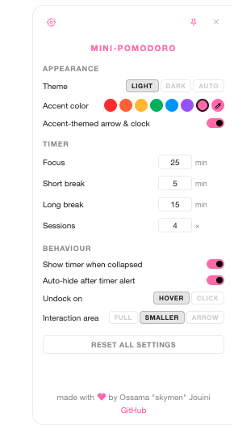

<p align="center">
  
</p>

<h1 align="center">Mini Pomodoro</h1>

<p align="center">
  A minimal, always-on-top Pomodoro timer that sits quietly on the edge of your screen.
</p>

<table align="center">
  <tr>
    <td align="center">
      <a href="https://github.com/skymen/mini-pomodoro/releases/latest/download/Mini.Pomodoro-1.2.0-universal.dmg">
        <br/>
        
        <br/>
        
      </a>
    </td>
    <td align="center">
      <a href="https://github.com/skymen/mini-pomodoro/releases/latest/download/Mini.Pomodoro.Setup.1.2.0.exe">
        <br/>
        
        <br/>
        
      </a>
    </td>
    <td align="center">
      <a href="https://github.com/skymen/mini-pomodoro/releases/latest/download/Mini.Pomodoro-1.2.0.x86_64.AppImage">
        <br/>
        
        <br/>
        
      </a>
    </td>
  </tr>
</table>

<p align="center">
  
  
</p>

---

Mini Pomodoro is a translucent desktop widget that docks to the edge of your screen and tucks itself away when you don't need it. It tracks focus sessions with a Pomodoro timer and keeps a simple drag-and-drop task list — nothing more, nothing less.

- **Always on top** — visible on every workspace and virtual desktop
- **Docks & auto-tucks** — slides into the screen edge after a short delay, peeking out with a small arrow or mini timer
- **Pin to stay** — pin the window so it stays expanded and never tucks away
- **Pomodoro timer** — configurable focus/break durations with session tracking
- **Inline task list** — add, reorder (drag-and-drop), edit, and check off tasks
- **Satisfying feedback** — subtle sounds and smooth animations for every interaction
- **Dark & light themes** — follows your system preference, or pick manually

---

## Customization

Pick any accent color — choose from presets or use the color picker for any shade you like. Toggle the accent-themed arrow and mini timer to make the collapsed indicator match.

<p align="center">
  
  
  
  
</p>

When the app is tucked away, the arrow and mini timer take on your accent color too:

<p align="center">
  
  
  
  
  
  
  
  
</p>

<p align="center">
  
  
  
  
  
  
  
  
</p>

---

## Settings

<p align="center">
  
</p>

### Appearance

| Setting                 | Description                                                                                     |
| ----------------------- | ----------------------------------------------------------------------------------------------- |
| **Theme**               | Switch between **Light**, **Dark**, or **Auto** (follows your OS).                              |
| **Accent color**        | Choose from 7 presets (red, orange, amber, green, blue, purple, pink) or pick any custom color. |
| **Accent-themed arrow** | Inverts the colors on the arrow so that the arrow is the one using the accent color.            |
| **Accent-themed clock** | Inverts the colors on the mini-timer so that the mini-timer is the one using the accent color.  |

### Timer

| Setting         | Description                                                     |
| --------------- | --------------------------------------------------------------- |
| **Focus**       | Duration of each focus session (1.2.0 min, default 25).         |
| **Short break** | Break between sessions (1–60 min, default 5).                   |
| **Long break**  | Break after completing all sessions (1–60 min, default 15).     |
| **Sessions**    | Number of focus sessions before a long break (1–12, default 4). |

### Behaviour

| Setting                         | Description                                                                                                                                                     |
| ------------------------------- | --------------------------------------------------------------------------------------------------------------------------------------------------------------- |
| **Show timer when collapsed**   | Display a mini countdown ring on the screen edge while the timer is running and the app is tucked.                                                              |
| **Auto-hide after timer alert** | Automatically tuck the app back after it pops out to notify you a phase ended.                                                                                  |
| **Undock on**                   | Choose **Hover** (expand on mouse-over) or **Click** (expand only when clicked).                                                                                |
| **Interaction area**            | Controls how much of the tucked strip responds to your mouse: **Full** (entire strip), **Smaller** (arrow + timer + edge), or **Arrow** (arrow and timer only). |

#### Docking

The app docks to whichever screen edge you drag it to and tucks itself away automatically:

<p align="center">
  
</p>

#### Interaction area

The interaction area setting lets you control exactly how much of the collapsed strip reacts to your cursor:

<p align="center">
  
</p>

---

## Development

```bash
npm install       # install dependencies
npm start         # build + launch the app
npm run dev        # watch mode (rebuild on changes)
npm run dist       # package for your platform
```

## Contributing

Contributions are welcome. Fork the repo, create a branch, and open a PR. Keep changes focused and test on at least one platform before submitting.

## License

ISC
